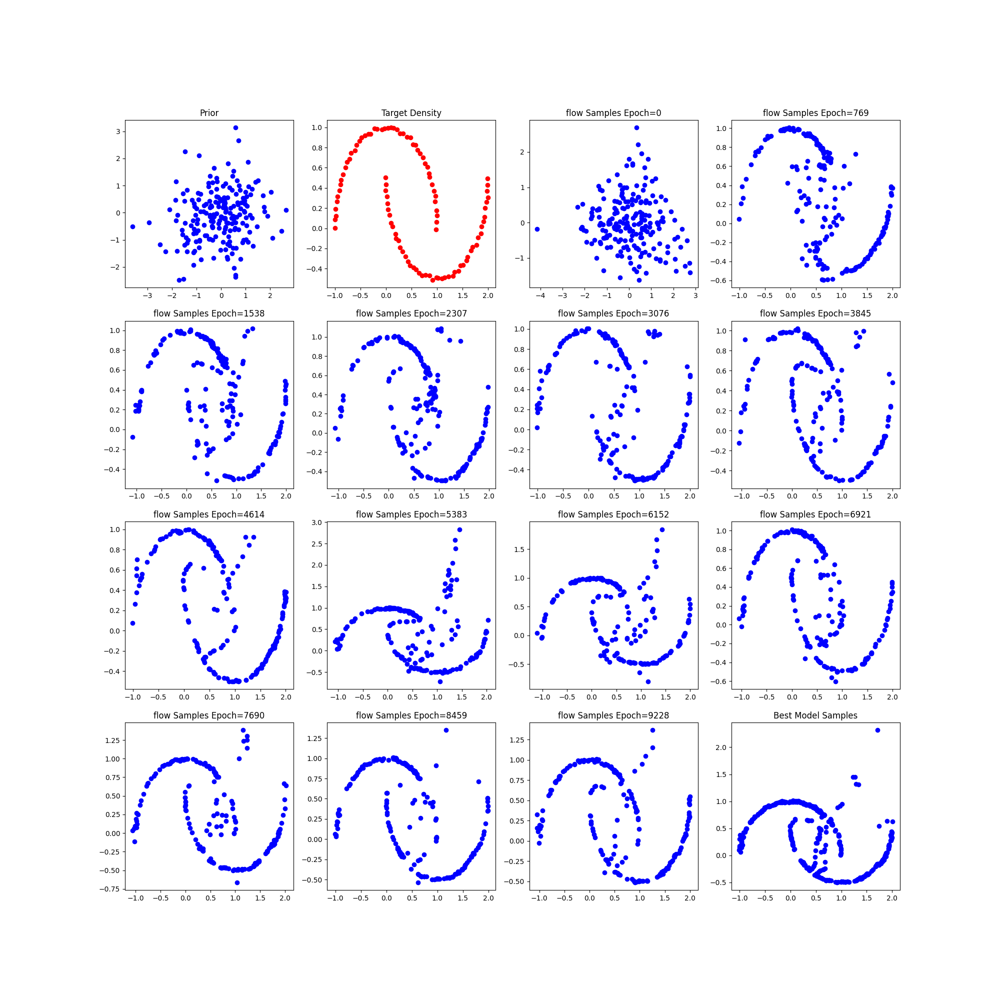
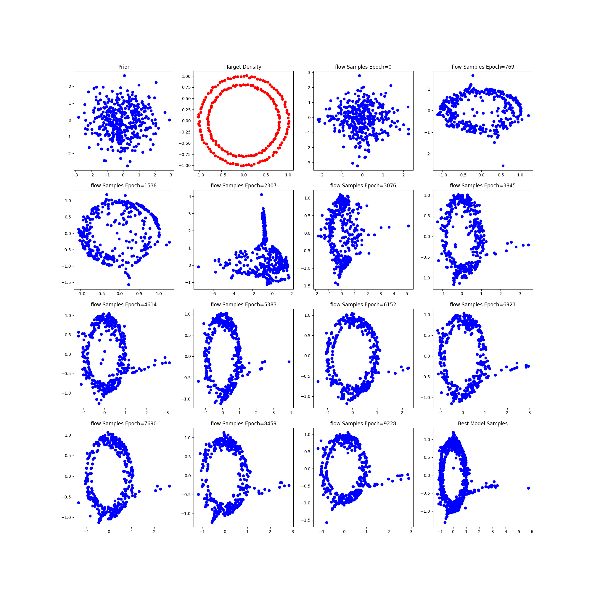
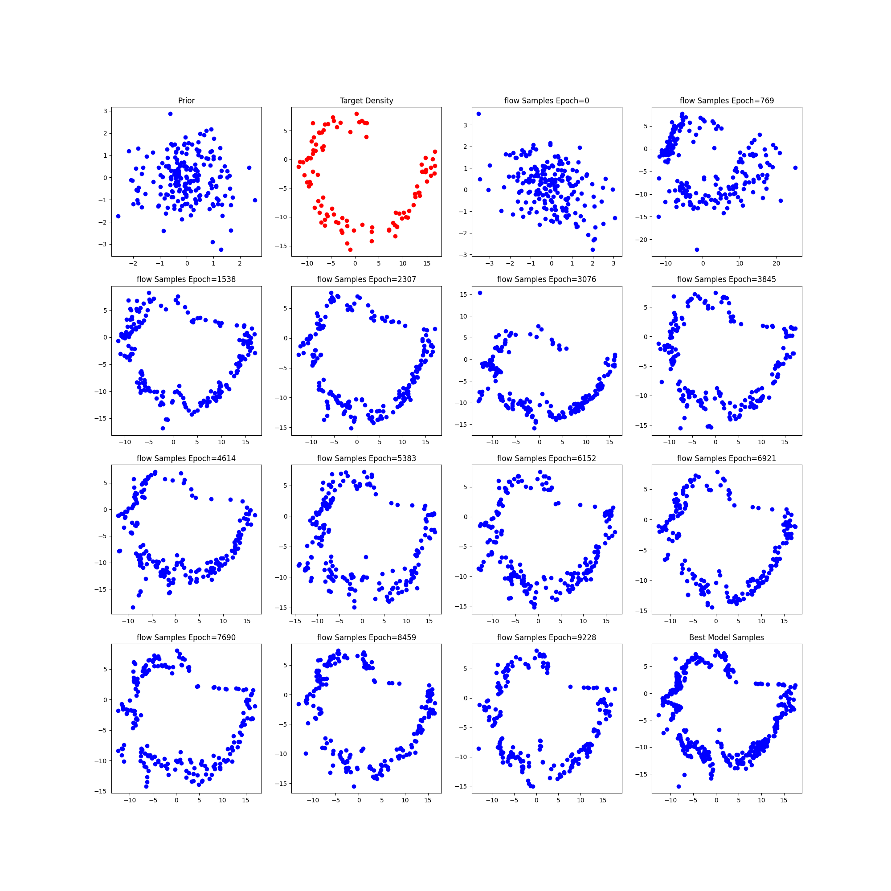
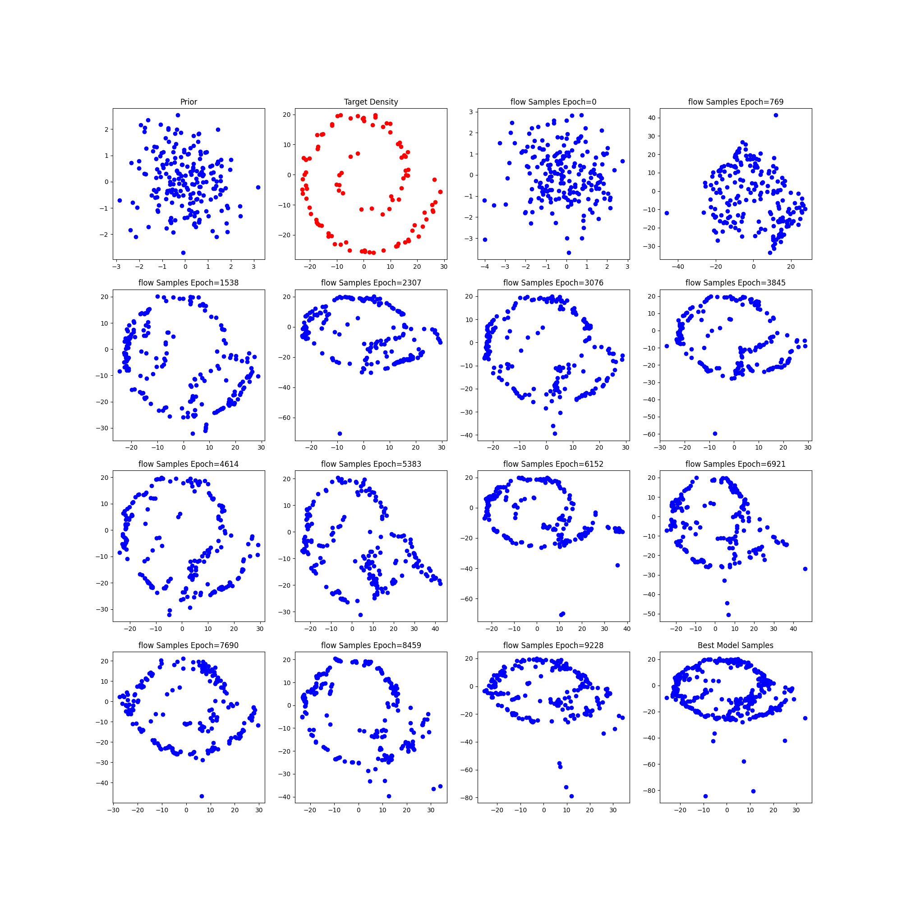

# Git Hub Directory Normalizing Flow Experiments

## This repository is the summary of the experiments done for CS6190 course.

Below are some of the sample outputs and links to ablation experiments performed for analysis

# Ablation Experiments

- [Changing Concatenation of Flows](sample-outputs/changingNOF.md)
- [Changing Complexity of flow models](sample-outputs/changingModel.md)
- [Changing Number of input Samples Provided](sample-outputs/changingSamples.md)
- [Changing Noise in input samples](sample-outputs/changingNoise.md)
- [Changing Activation](sample-outputs/changingAct.md)

# Sample Outputs
## Two Moon Distribution samples from flow till epoch=10000

## Circles Distribution samples from flow till epoch=10000

## Spiral Distribution samples from flow till epoch=10000

## Spiral 4 Distribution samples from flow till epoch=10000

