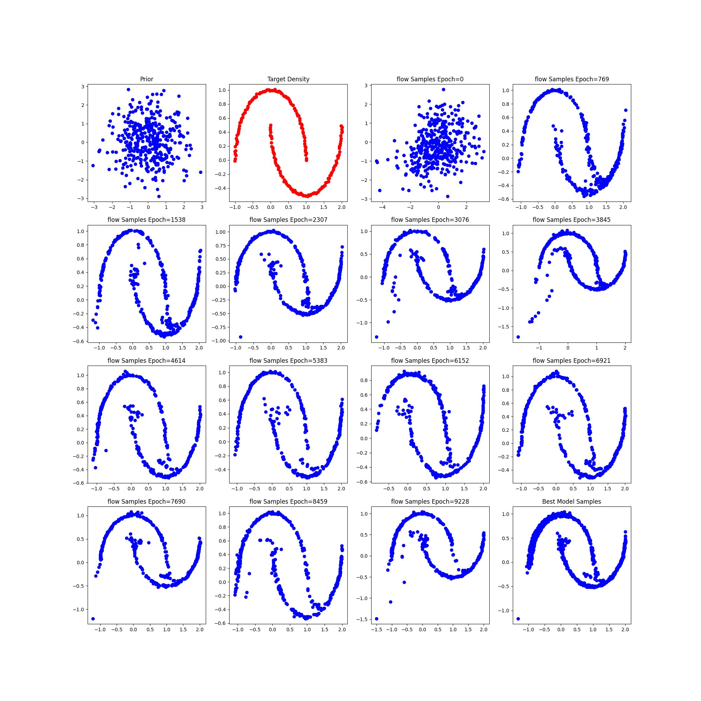
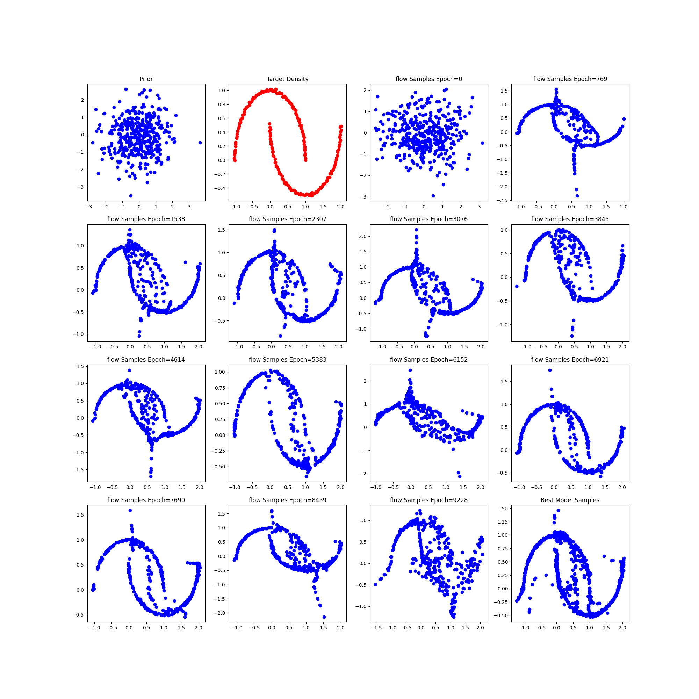
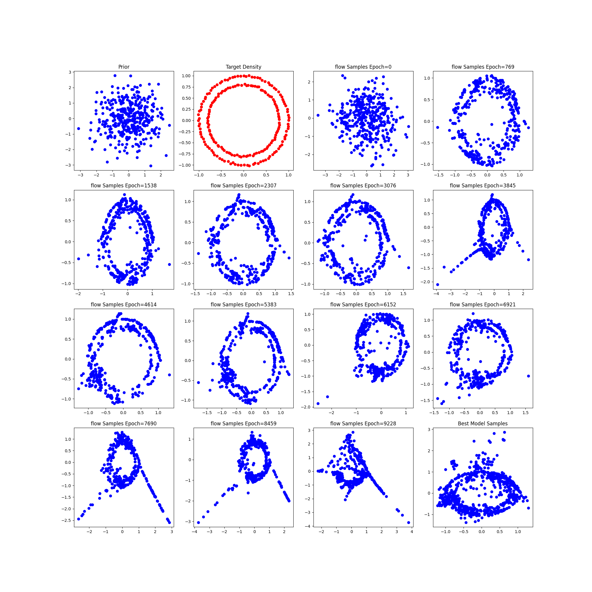
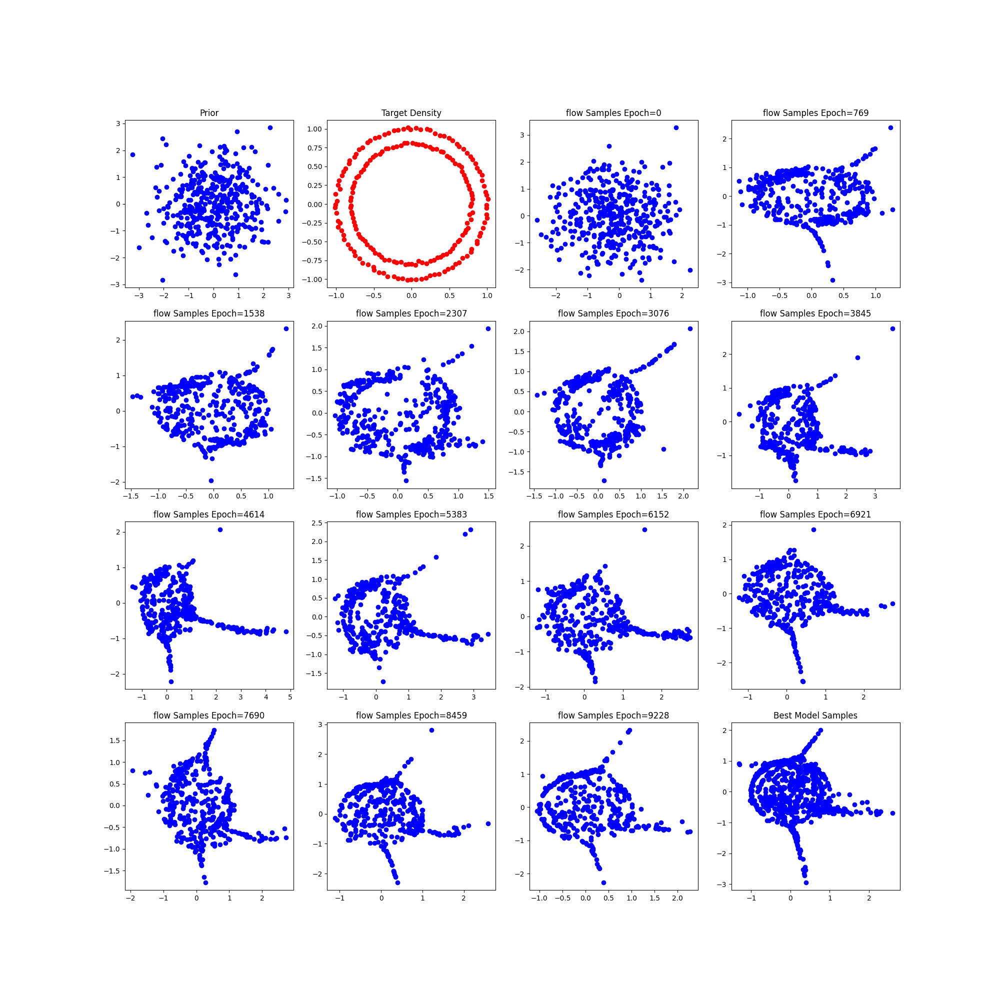
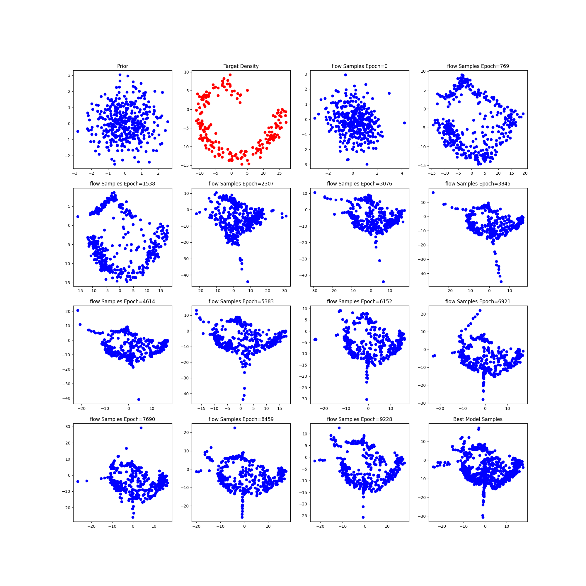
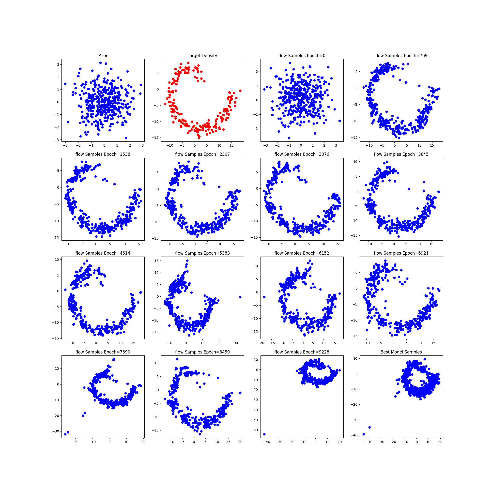
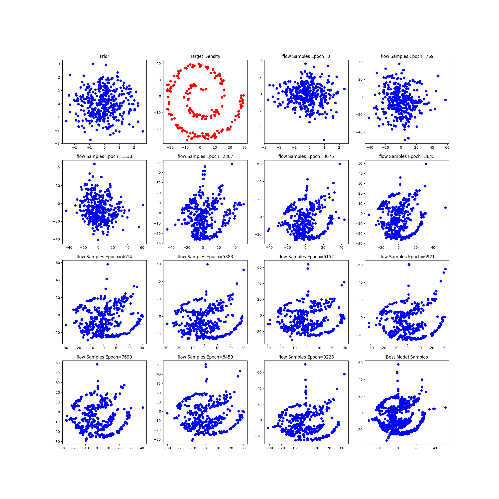
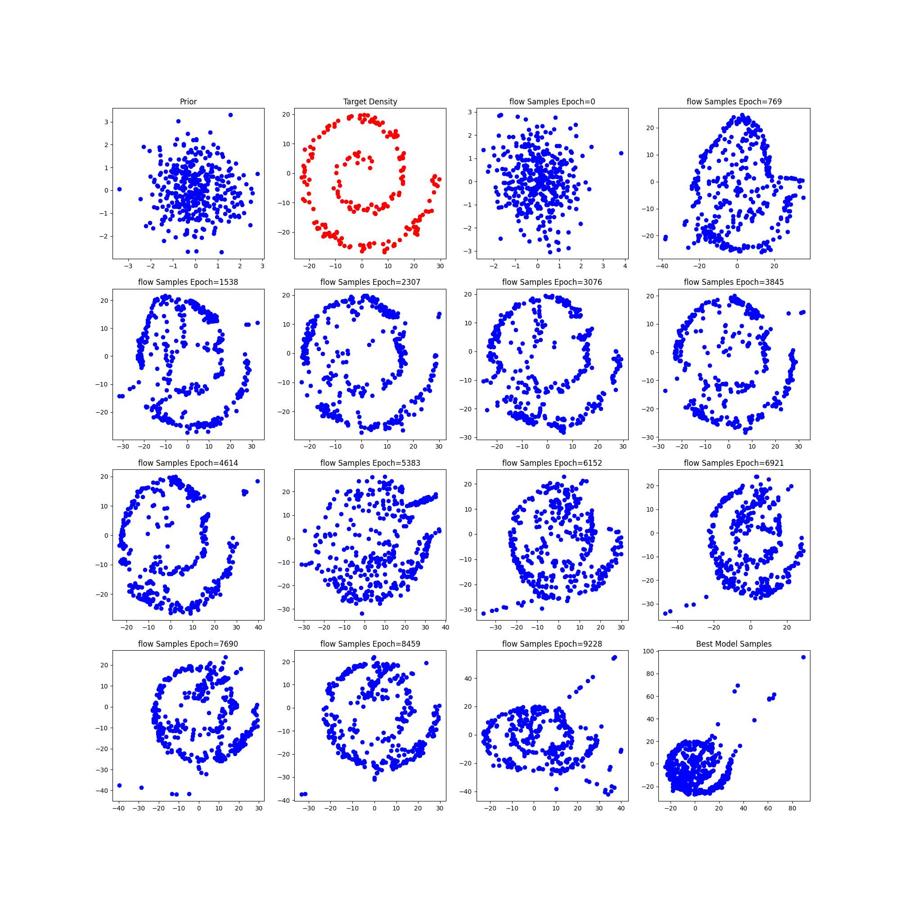

# Changing the number of flows contenated for final output

## Two Moon

Number of samples 200, noise =0.01, intermediate layers =2, flow=6

### relu

### Leaky Relu 

Number of samples 200, noise =0.01, intermediate layer= 4, flow=9
### relu

### leaky relu

## Circle
Number of samples 200, noise =0.01, intermediate layers =2, flow=6

### relu

### Leaky Relu 

Number of samples 200, noise =0.01, intermediate layer= 4, flow=9
### relu

### leaky relu

## Spiral 2
Number of samples 200, noise =0.01, intermediate layers =2, flow=6

### relu

### Leaky Relu 

Number of samples 200, noise =0.01, intermediate layer= 4, flow=9
### relu

### leaky relu

## Spiral 4
Number of samples 200, noise =0.01, intermediate layers =2, flow=6

### relu

### Leaky Relu 

Number of samples 200, noise =0.01, intermediate layer= 4, flow=9
### relu

### leaky relu

