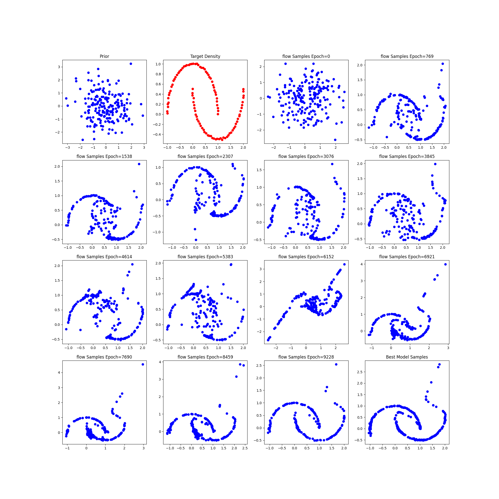
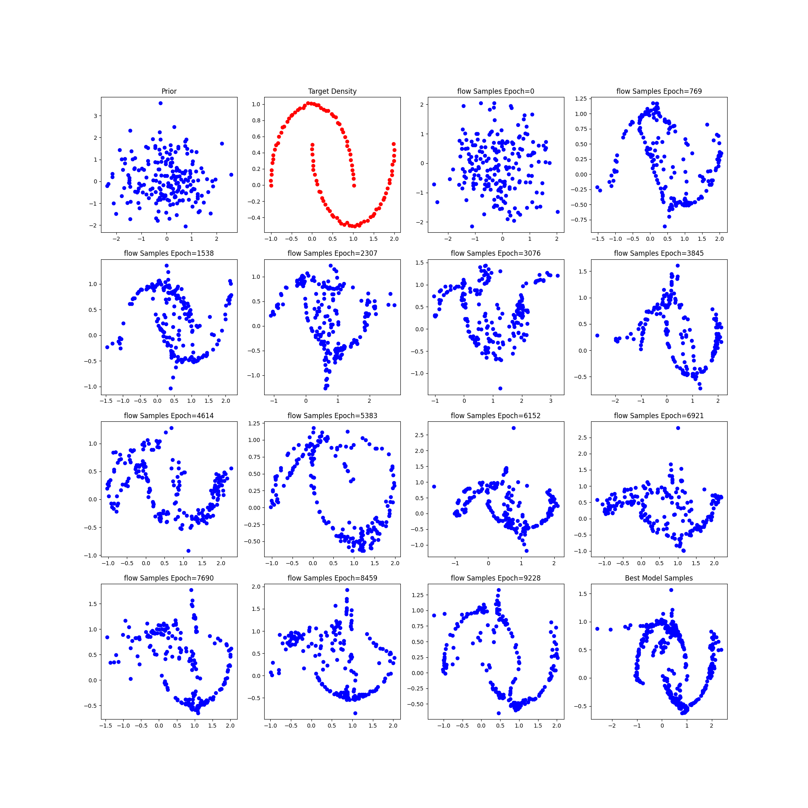
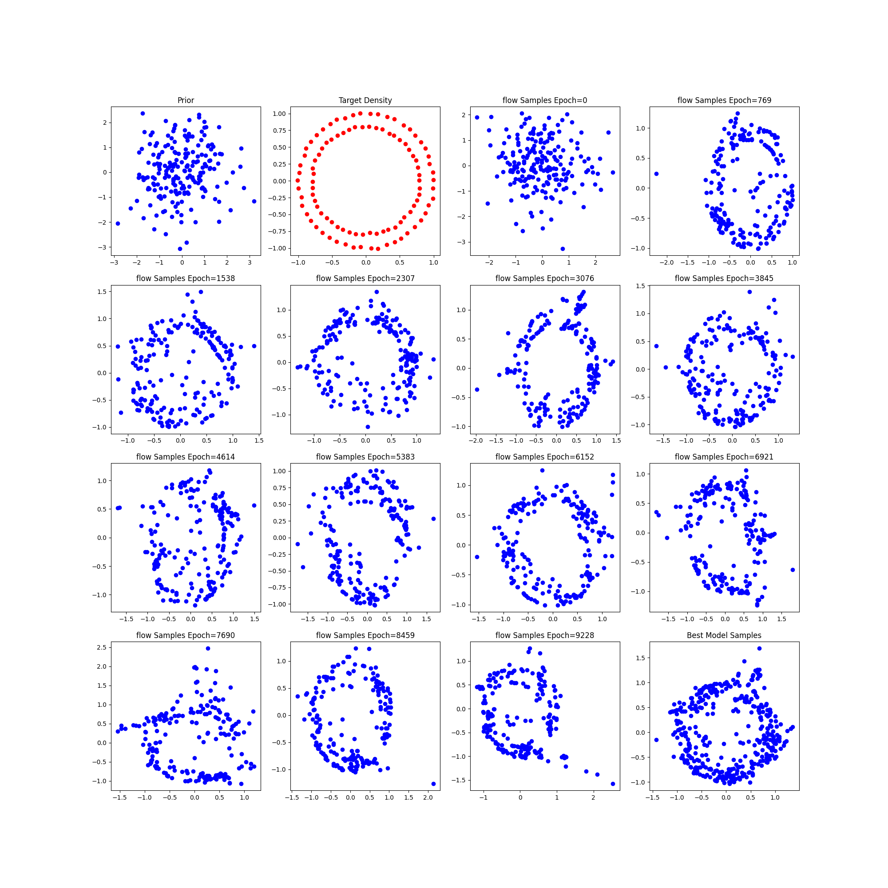
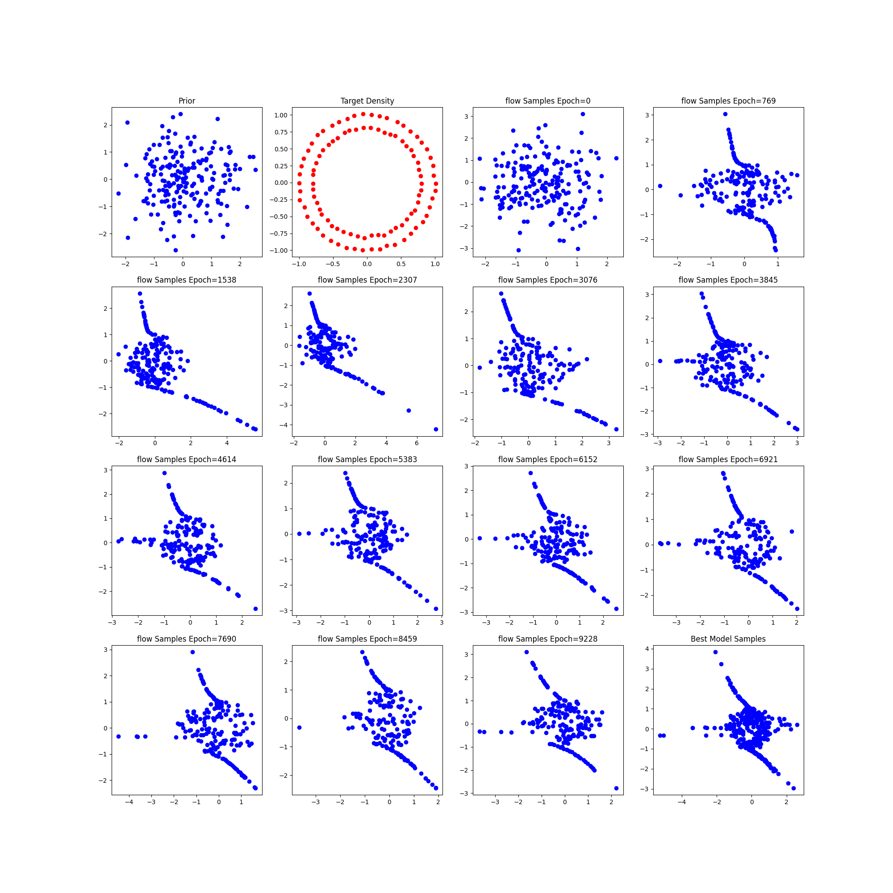

# Changing the Complexity of each normalizing flow

## Two Moon

Number of flows 6 , Number of samples 100, noise =0.01

### 2 intermediate layers

### 4 intermediate layers

### 6 intermediate layers

## Circle
Activation Relu, Number of samples 100, noise =0.01

### 2 intermediate layers

### 4 intermediate layers

### 6 intermediate layers

## Spiral 2
Activation Leaky Relu, Number of samples 100, noise =0.01

### 2 intermediate layers

### 4 intermediate layers

### 6 intermediate layers

## Spiral 4
Activation Relu, Number of samples 100, noise =0.01

### 2 intermediate layers

### 4 intermediate layers

### 6 intermediate layers

