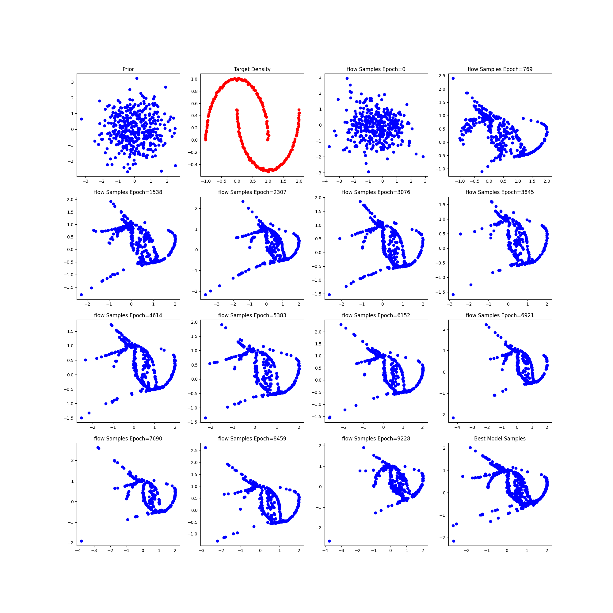
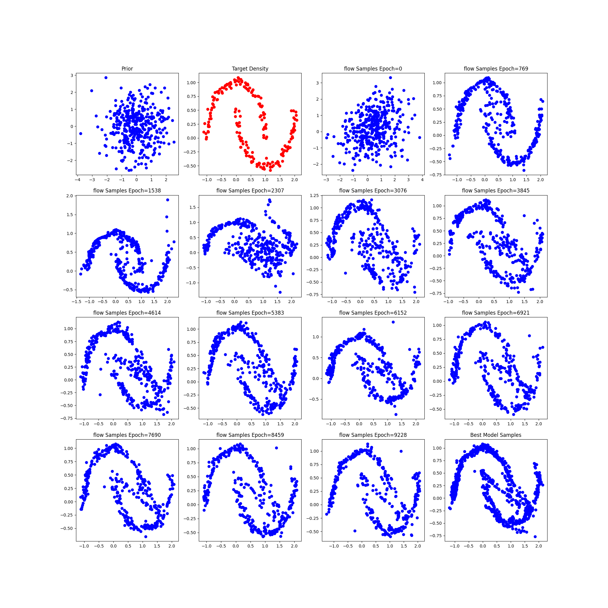
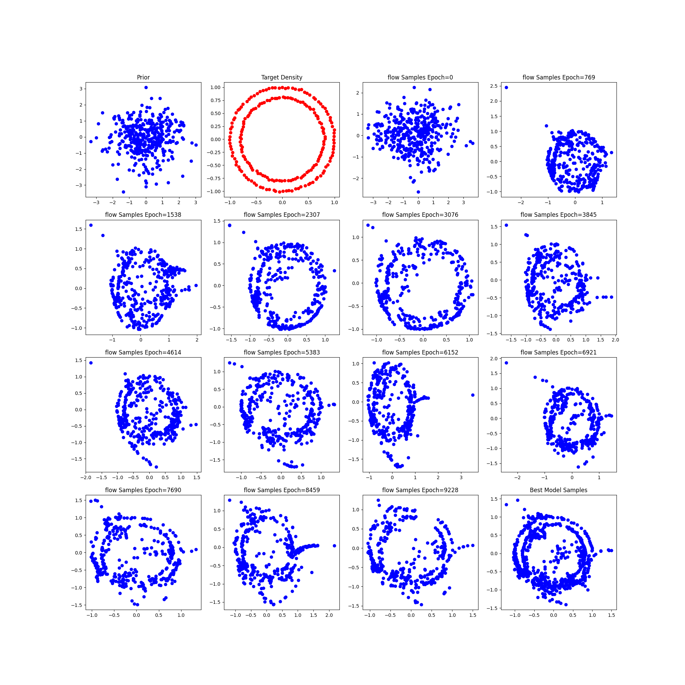
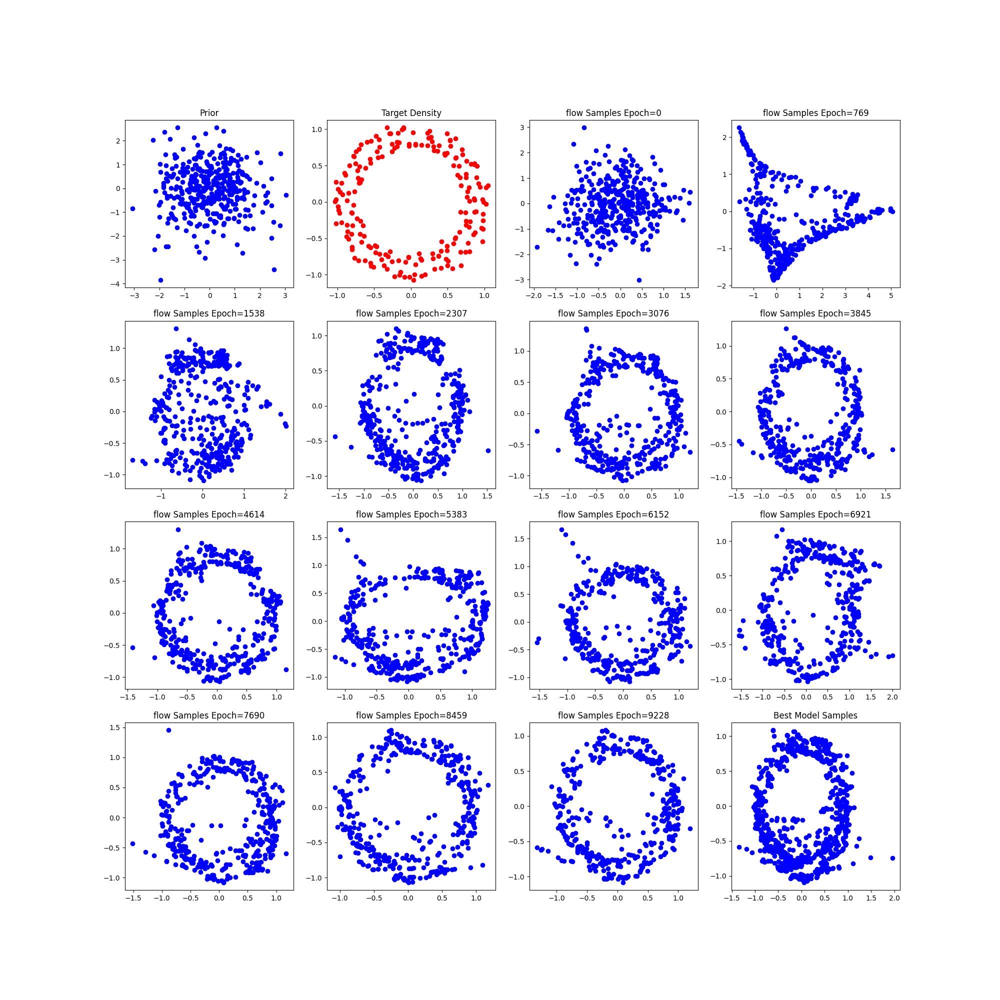
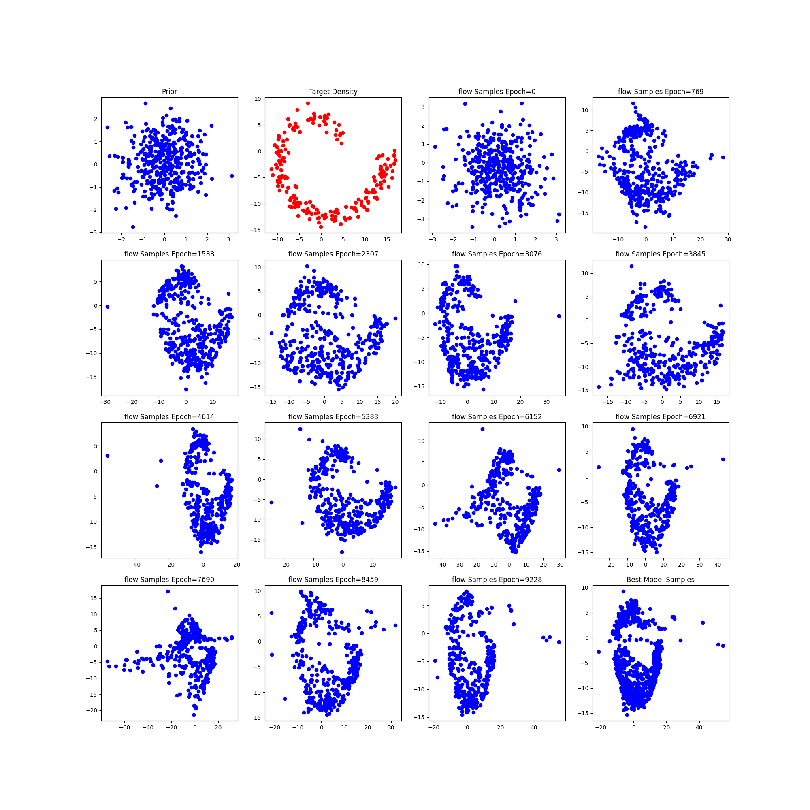
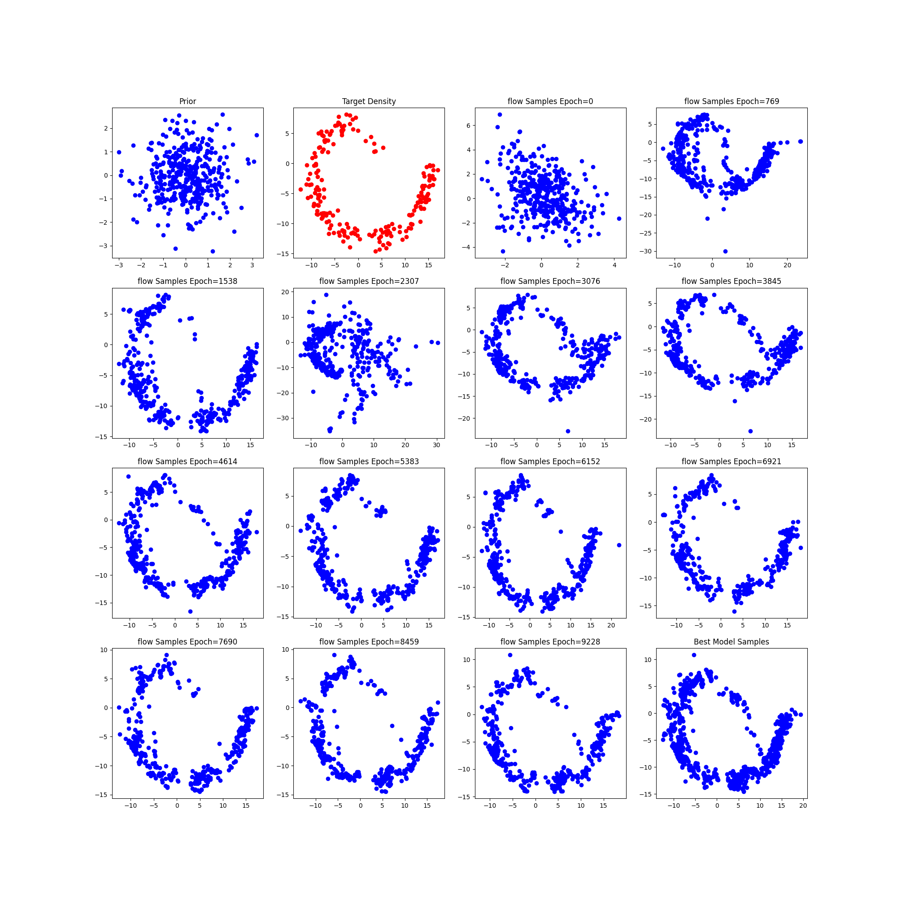
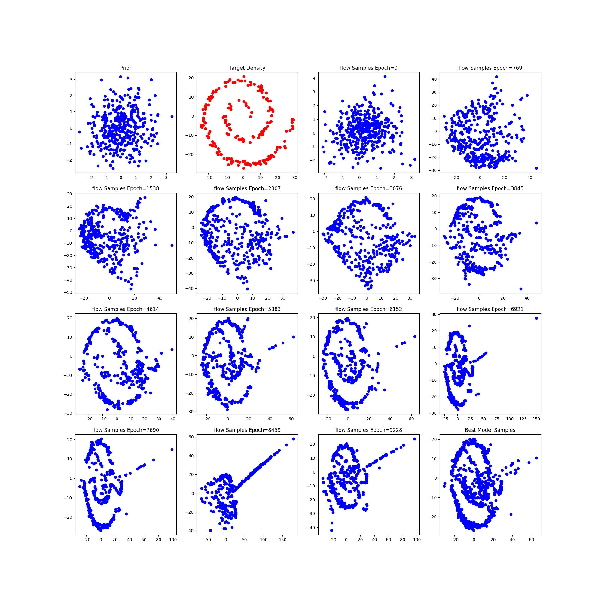

# Changing the Complexity of each normalizing flow

## Two Moon

Number of flows 9 , act relu, 2 intermeditate layers

### Noise = 0.01

### Noise = 0.05

## Circle
Number of flows 9 , act relu, 2 intermeditate layers

### Noise = 0.01

### Noise = 0.05

## Spiral 2
Number of flows 9 , act relu, 2 intermeditate layers

### Noise = 0.01

### Noise = 0.05

## Spiral 4
Number of flows 9 , act relu, 2 intermeditate layers

### Noise = 0.01

### Noise = 0.05

