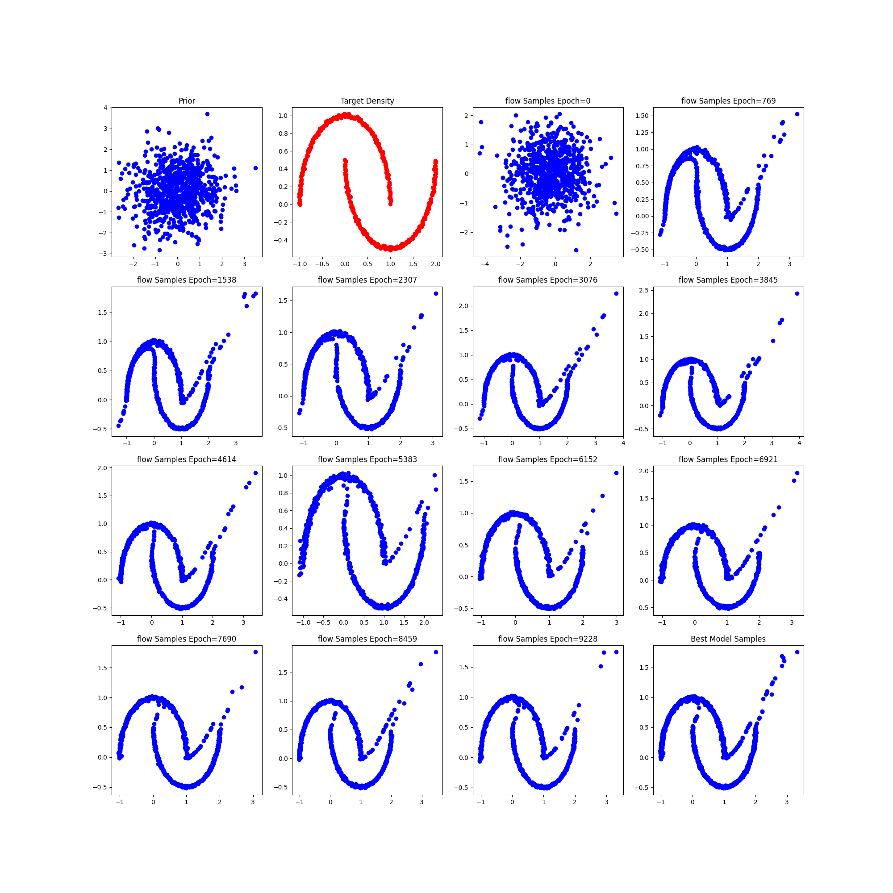
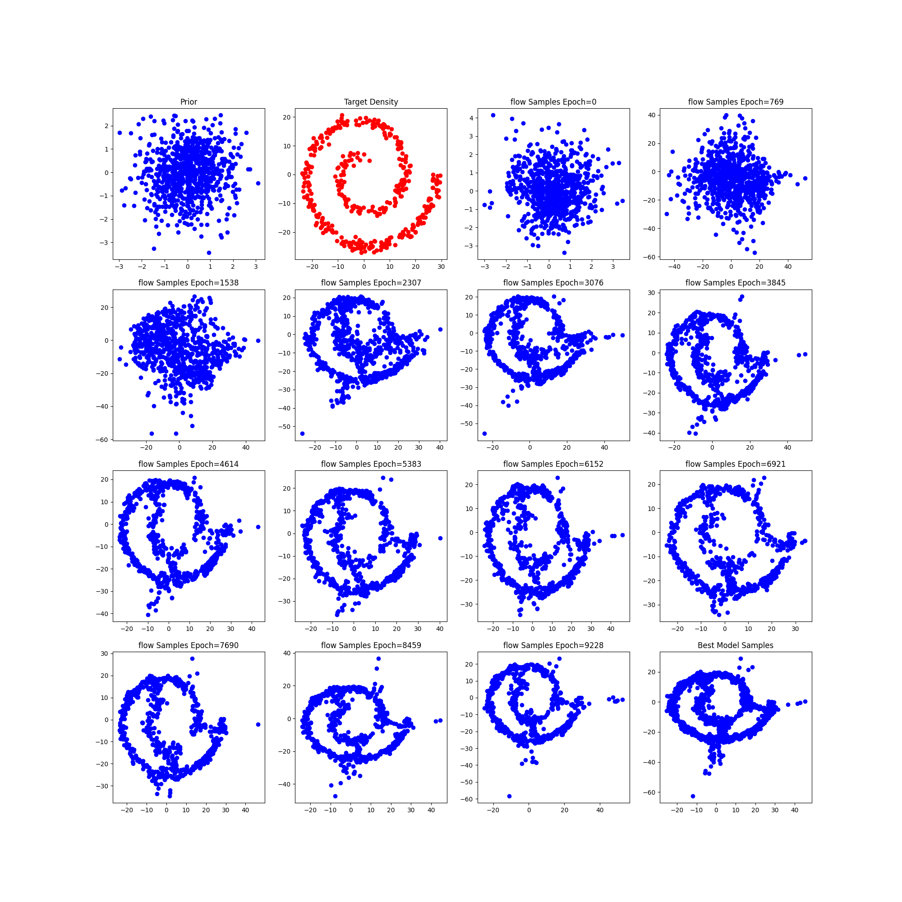

# Changing the Complexity of each normalizing flow

## Two Moon

Number of flows 6 , act relu, 2 intermeditate layers, noise =0.01

### Number of Input Samples 100

### Number of Input Samples 200

### Number of Input Samples 400

## Circle
Activation Relu, Number of samples 100, noise =0.01

### Number of Input Samples 100

### Number of Input Samples 200

### Number of Input Samples 400

## Spiral 2
Activation Leaky Relu, Number of samples 100, noise =0.01

### Number of Input Samples 100

### Number of Input Samples 200

### Number of Input Samples 400

## Spiral 4
Activation Relu, Number of samples 100, noise =0.01

### Number of Input Samples 100

### Number of Input Samples 200

### Number of Input Samples 400

